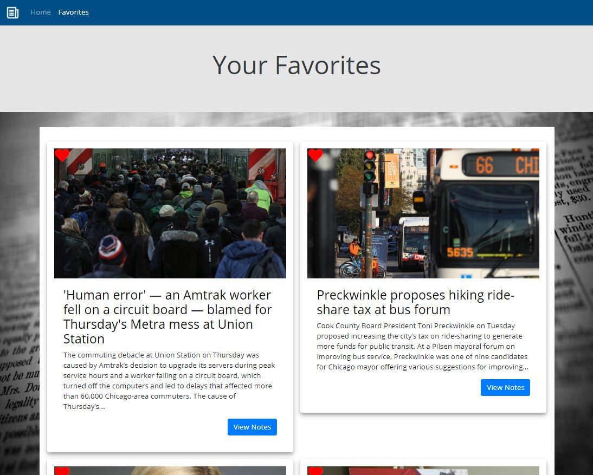

# News Scraper

This is a full-stack web scraper application that scrapes the Chicago Tribune for news articles and displays the top 20 results on the main screen. Built using Node, Handlebars, Mongo DB, Express, and Axios. 

To run the application locally run the following: 
1. `npm install`
2. `npm run`

The application is deployed [here](https://noel-news-scraper.herokuapp.com/).

## Using the application

* When the user visits the application the server will grab the latest articles from the Chicago Tribune website and displays them on screen. 

    

* Each article card contains the article image, title, text, a button on the upper left to favorite the article, and a button to view notes that have been added to the article. 

    

* When the user clicks on the `favorite` button on the upper left hand corner of the article card the favorite icon will fill with color and the article will be displayed in the favorites section

    

* When the user clicks on the `view notes` button on the article card a modal will appear that shows all notes that the article contains from any user and the ability to add notes, edit notes and delete notes. 

    

* The favorites section displays all favorites that the user has selected. 

    
